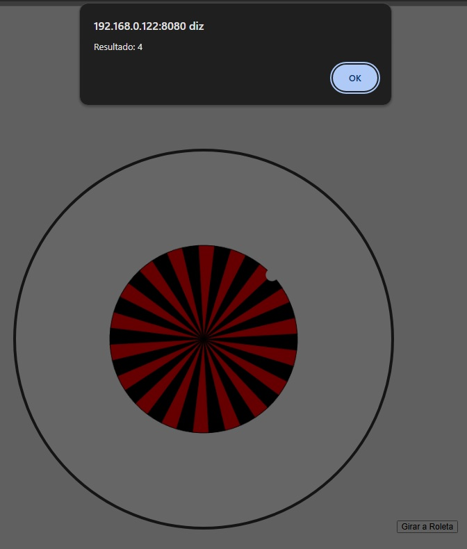
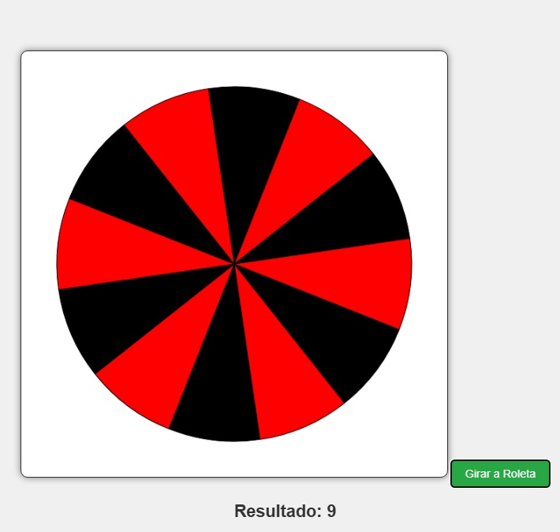

# Handson com Copilot

Durante o curso, aprendi várias coisas interessantes. Aqui estão alguns insights e aprendizados.

## Projetos
- **RoletaCloud**: O código gerado pelo **Cloud Sonnet** funcionou muito melhor que o do **O3 Roleta**.

- **O3Roleta**: Apesar de funcionar, o código gerado pelo O3Roleta não teve o mesmo desempenho ou eficiência comparado ao Cloud Sonnet.

- **Flapbird**: Não obtive sucesso com o projeto Flapbird. Encontrei alguns problemas que não consegui resolver a tempo.

- **Busca CEP**: Também não consegui concluir o projeto Busca CEP, devido a dificuldades técnicas com a API e integração.

## Prints
Aqui estão alguns prints dos projetos mencionados:

## Possibilidades
- Aprendi como utilizar APIs em projetos de front-end.
- Descobri como implementar jogos simples com interatividade.
- Explorei algumas ferramentas que geram código automaticamente, como o Cloud Sonnet, que podem otimizar o fluxo de trabalho.
